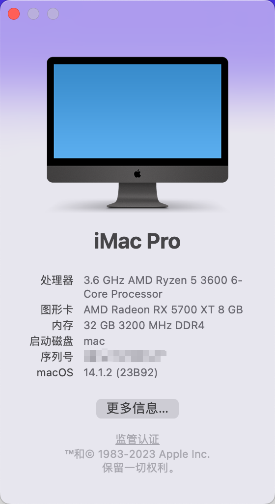
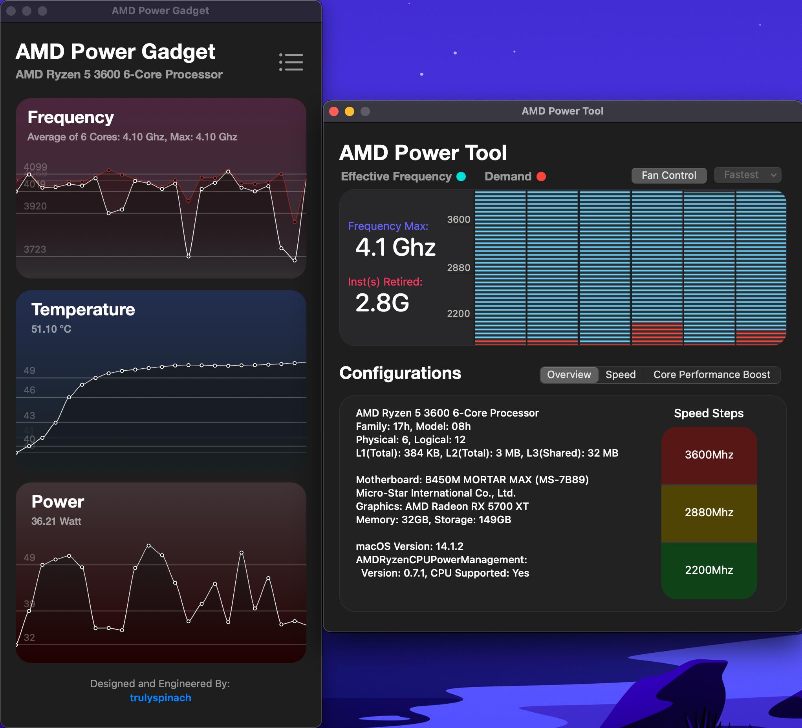
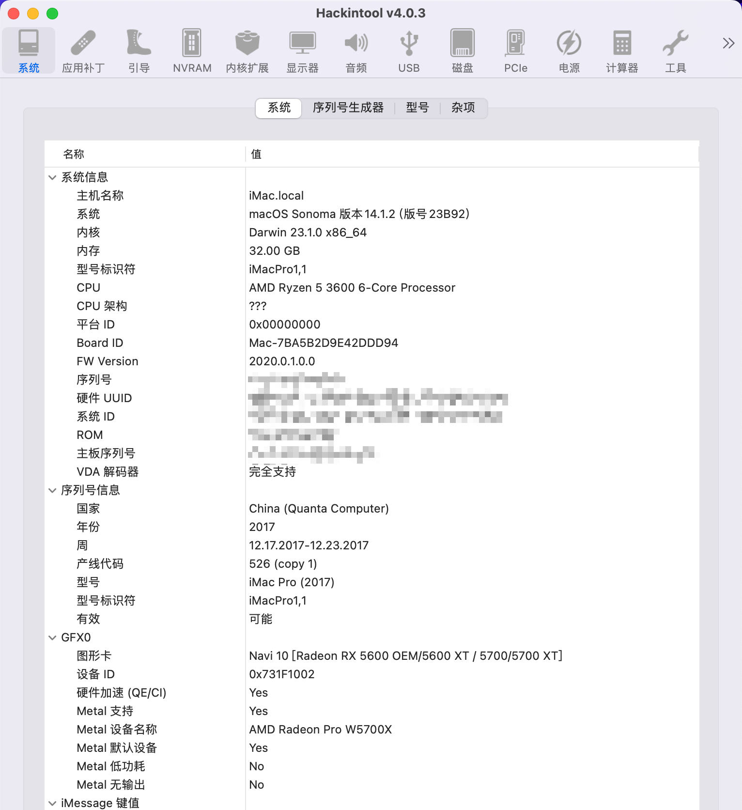
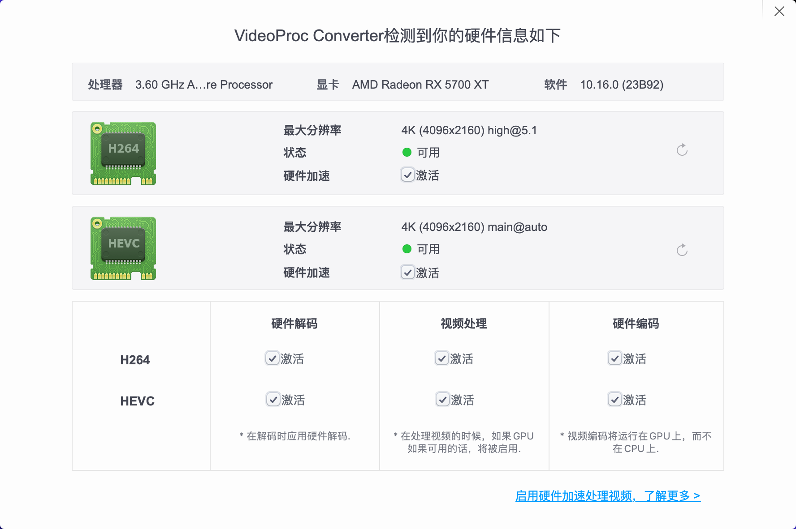

# Hackintosh-OC-MSI-B450M-3600

### EFI介绍

> 通过 [Dortania](https://dortania.github.io/OpenCore-Install-Guide/) 定制OpenCore引导，**请自行参考进行一些自定义的修改**
>
> **当前oc使用的release版本，安装自行切换debug版调试**；测试不一定充分，酌情使用

|     类型 |                  |
| ------------: | :--------- |
| Mac 版本      | 14.1.2     |
| Opencore 版本 | 0.9.6      |
| 更新日期      | 2023-12-08 |

### 配置清单

|     类型 | 型号                 |
| -------: | :------------------- |
|     主板 | MSI B450M MORTAR MAX |
|      CPU | AMD R5 3600          |
|     显卡 | RX 5700XT            |
| 无线网卡 | Intel AX200          |

### 功能

**正常使用**

- 有线、无线网络
- 蓝牙(iPod pro 有时没有声音；其他蓝牙音箱无问题)
- USB(2.0、3.0)
- 睡眠唤醒
- 声音前后输出
- iMessage、iCloud
- 接力、粘贴板

**不能使用**

- 前后音频输入、内置音频(可用usb或者蓝牙代替)
- 随航、隔空投送(网卡限制)

### **注意**⚠️

**登陆Apple ID前请先使用`Hackintool`等工具重新生成序列号等信息**

### 致谢

- https://github.com/acidanthera/OpenCorePkg

- [Dortania](https://dortania.github.io/OpenCore-Install-Guide/) 
- https://github.com/OpenIntelWireless/itlwm
- [国光的黑苹果安装教程：手把手教你配置 OpenCore](https://apple.sqlsec.com/)
